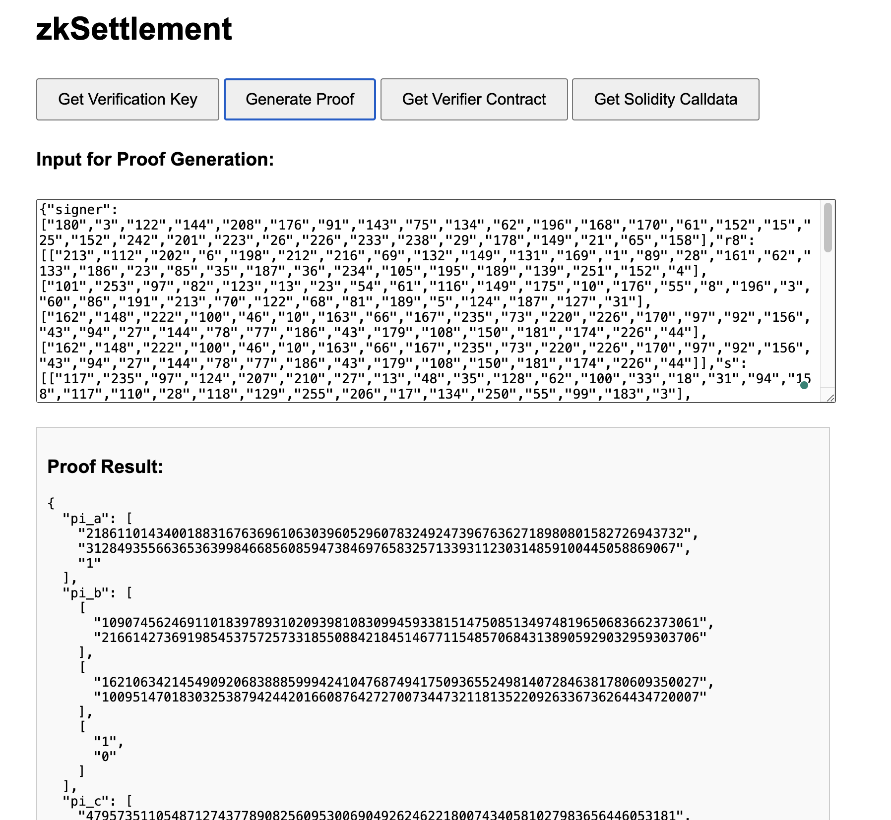

# zkSettlement
> 0G serving network adopts a free marketplace where users and service providers decide the prices of the services through a peer-to-peer fashion. The service provider is free to quote their services, and then users are free to choose the services that are priced appropriately for them to use.
> The service provider can decide at any point to send the request traces with user’s signature to the smart contract for settlement. Once settlement is done, the corresponding portion of the pre-charged fee can be sent to service provider’s account. 

Users and service providers conduct off-chain service transactions, and service providers can consume the _request traces_ generated from each service transaction to settle service fees on-chain and update user balances.


# Why zk？
As shown in the figure above, on-chain nodes need to execute all complete state transition processes sequentially, which is often costly. With the introduction of zk:

1. Multiple state transition processing can be batched into one init to final state transition.
2. On-chain nodes only need to execute the proof verification process, which is often relatively cheap.

For more details on the design and implementation, please see our [Design Documentation](./doc/DESIGN.md).

# Dependence
### Linux
node-v20.5.0
### mac
node-v20.15.1

Note: The above version is the version that has passed the verification, and is not the only or minimum version.
# Quick
## Compile circuit
```shell
yarn compile
```
## Trust setup
```shell
yarn setup
```

## Start service
```shell
yarn start
```

## Access with web
Open your web browser (such as Chrome, Firefox, etc.). Enter in the address bar: http://[server IP address]:3000 (for example: http://127.0.0.1:3000). You should see the zkSettlment prover agent web interface.


The web interface provides the following functionalities:
### Get Verification Key

1. Click the "Get Verification Key" button.
2. The agent will display the verification key.
### Generate Proof

1. Enter the required input data (in JSON format) in the text box.
2. Click the "Generate Proof" button.
3. The agent will generate the proof and display the result.
### Get Verifier Contract

1. Click the "Get Verifier Contract" button.
2. The agent will generate and display the Solidity verifier contract code.

### Get Solidity Calldata
1. Enter the required input data (in JSON format) in the text box.
2. Click the "Get Solidity Calldata" button.
3. The agent will generate and display the Solidity Calldata.

## Access with CURL
You can also use the zkSettlement prover agent's functionalities by directly calling the API.
For detailed API documentation and usage examples, please refer to our [API Documentation](./doc/API.md).

# Contributing
Contributions are welcome! Please feel free to submit a Pull Request.

# License
MIT License